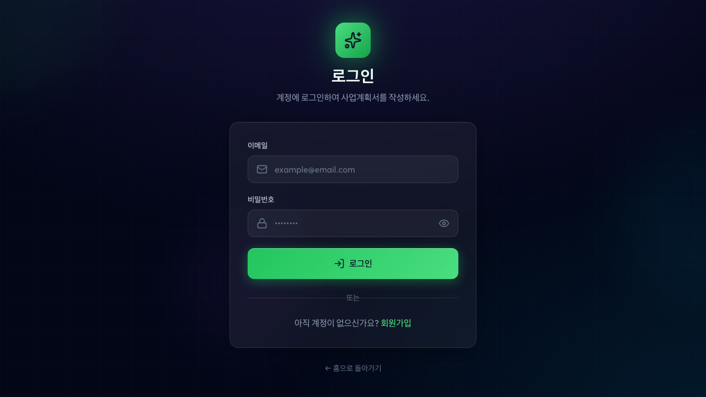
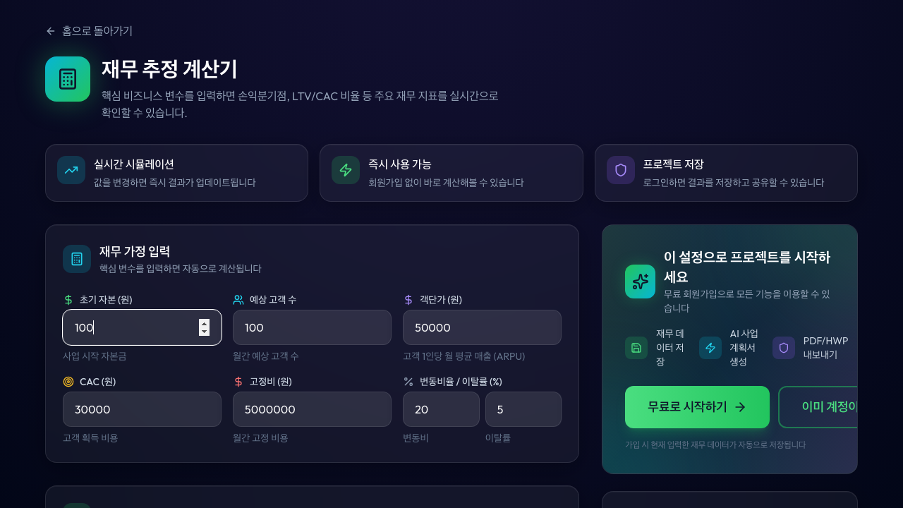

# Playwright E2E 테스트 결과 보고서

**테스트 실행일시**: 2024년 12월 13일  
**브라우저**: Chromium  
**환경**: macOS / Node.js

---

## 📊 테스트 요약

| 항목 | 결과 |
|------|------|
| **총 테스트 수** | 73 |
| **통과** | 19 (26%) |
| **실패** | 54 (74%) |
| **스킵** | 0 |

### 상태별 분포

```
통과 ████████                          19
실패 ██████████████████████████████    54
```

---

## 📁 테스트 파일별 결과

### 1. auth.spec.ts (인증)
| 테스트 | 상태 | 비고 |
|--------|------|------|
| 로그인 페이지가 정상적으로 렌더링된다 | ✅ 통과 | |
| 빈 폼 제출 시 유효성 검사 에러가 표시된다 | ✅ 통과 | |
| 잘못된 이메일 형식 입력 시 에러가 표시된다 | ❌ 실패 | 셀렉터 조정 필요 |
| 짧은 비밀번호 입력 시 에러가 표시된다 | ❌ 실패 | 에러 메시지 형식 차이 |
| 유효한 자격 증명으로 로그인 성공 | ❌ 실패 | Mock API 미구현 |
| 회원가입 페이지로 이동할 수 있다 | ✅ 통과 | |
| 회원가입 페이지가 정상적으로 렌더링된다 | ❌ 실패 | 셀렉터 조정 필요 |
| 비밀번호 불일치 시 에러가 표시된다 | ❌ 실패 | |
| 비밀번호 강도 표시기가 동작한다 | ❌ 실패 | |
| 로그인 페이지로 이동할 수 있다 | ✅ 통과 | |

### 2. wizard.spec.ts (Wizard)
| 테스트 | 상태 | 비고 |
|--------|------|------|
| 메인 페이지가 정상적으로 렌더링된다 | ❌ 실패 | 텍스트 매칭 조정 필요 |
| 프로젝트 이름 입력 필드가 있다 | ❌ 실패 | |
| 템플릿 카드를 선택할 수 있다 | ❌ 실패 | |
| 프로젝트 생성 후 Wizard로 이동한다 | ❌ 실패 | |
| Step 1: 아이템 개요 페이지가 렌더링된다 | ❌ 실패 | |
| 다음 버튼으로 Step 2로 이동할 수 있다 | ❌ 실패 | |
| 이전 버튼으로 뒤로 이동할 수 있다 | ❌ 실패 | |
| 사이드바에서 진행 상태를 확인할 수 있다 | ❌ 실패 | |
| 질문에 답변을 입력할 수 있다 | ❌ 실패 | |
| 재무 시뮬레이션 페이지가 렌더링된다 | ❌ 실패 | |
| 재무 지표가 표시된다 | ❌ 실패 | |
| PMF 설문 페이지가 렌더링된다 | ❌ 실패 | |

### 3. business-plan.spec.ts (사업계획서)
| 테스트 | 상태 | 비고 |
|--------|------|------|
| 사업계획서 페이지가 정상적으로 렌더링된다 | ✅ 통과 | |
| 섹션 목록이 표시된다 | ✅ 통과 | |
| 섹션 내용이 표시된다 | ✅ 통과 | |
| 내보내기 드롭다운이 있다 | ✅ 통과 | |
| 내보내기 드롭다운을 열 수 있다 | ✅ 통과 | |
| PDF 내보내기를 선택할 수 있다 | ❌ 실패 | |
| HTML 내보내기를 선택할 수 있다 | ❌ 실패 | |
| 버전 히스토리 패널이 있다 | ✅ 통과 | |
| 버전 히스토리 패널을 열 수 있다 | ✅ 통과 | |
| 섹션 재생성 버튼이 있다 | ❌ 실패 | |

### 4. calculator.spec.ts (재무 계산기)
| 테스트 | 상태 | 비고 |
|--------|------|------|
| 재무 계산기 페이지가 정상적으로 렌더링된다 | ❌ 실패 | 다중 요소 매칭 |
| 입력 폼이 표시된다 | ❌ 실패 | toHaveCount 문법 오류 |
| 고객 수를 입력할 수 있다 | ✅ 통과 | |
| 가격을 입력할 수 있다 | ✅ 통과 | |
| 계산 결과가 실시간으로 표시된다 | ✅ 통과 | |
| 핵심 지표 카드가 표시된다 | ❌ 실패 | 다중 요소 매칭 |
| 차트가 표시된다 | ✅ 통과 | |
| 비로그인 시 CTA 배너가 표시된다 | ✅ 통과 | |
| CTA 버튼 클릭 시 로그인 페이지로 이동한다 | ✅ 통과 | |

### 5. profile.spec.ts (프로필)
| 테스트 | 상태 | 비고 |
|--------|------|------|
| 프로필 페이지가 정상적으로 렌더링된다 | ❌ 실패 | localStorage 설정 문제 |
| 탭 네비게이션이 있다 | ❌ 실패 | |
| 프로필 편집 폼이 표시된다 | ❌ 실패 | |
| 이름을 수정할 수 있다 | ❌ 실패 | |
| 저장 버튼이 있다 | ❌ 실패 | |
| 비밀번호 변경 폼이 표시된다 | ❌ 실패 | |
| 비밀번호 강도 표시기가 동작한다 | ❌ 실패 | |
| 비밀번호 불일치 시 에러가 표시된다 | ❌ 실패 | |
| 계정 삭제 버튼이 있다 | ❌ 실패 | |
| 계정 삭제 클릭 시 확인 모달이 표시된다 | ❌ 실패 | |
| 모달에서 취소를 클릭하면 모달이 닫힌다 | ❌ 실패 | |

### 6. navigation.spec.ts (네비게이션)
| 테스트 | 상태 | 비고 |
|--------|------|------|
| 메인 페이지 (/) 접근 가능 | ✅ 통과 | |
| 로그인 페이지 (/login) 접근 가능 | ✅ 통과 | |
| 회원가입 페이지 (/signup) 접근 가능 | ✅ 통과 | |
| 재무 계산기 페이지 (/calculator) 접근 가능 | ✅ 통과 | |
| Wizard 페이지 (/wizard/:stepId) 접근 가능 | ❌ 실패 | 리다이렉트 발생 |
| 사업계획서 페이지 (/business-plan) 접근 가능 | ❌ 실패 | |
| 존재하지 않는 페이지 접근 시 404 페이지 표시 | ❌ 실패 | |
| 404 페이지에서 홈으로 돌아갈 수 있다 | ❌ 실패 | |
| 에러 페이지 (/error) 접근 가능 | ❌ 실패 | |
| 에러 페이지에서 홈으로 돌아갈 수 있다 | ❌ 실패 | |
| 에러 페이지에서 새로고침 버튼이 있다 | ❌ 실패 | |
| 뒤로가기가 정상 동작한다 | ❌ 실패 | |
| 앞으로가기가 정상 동작한다 | ❌ 실패 | |
| 로그인 페이지에서 회원가입 링크 동작 | ❌ 실패 | |
| 회원가입 페이지에서 로그인 링크 동작 | ❌ 실패 | |
| Wizard 단계 URL이 올바르게 변경된다 | ❌ 실패 | |

---

## 📸 스크린샷

테스트 실행 중 캡처된 스크린샷은 `screenshots/` 디렉토리에 저장되어 있습니다.

### 주요 스크린샷 예시

#### 로그인 페이지


#### 사업계획서 뷰어


#### 재무 계산기


---

## 🔍 실패 원인 분석

### 1. 셀렉터 불일치
- 테스트 코드의 셀렉터가 실제 UI 요소와 정확히 일치하지 않음
- 예: `getByText(/사업계획서/i)` → 다중 요소 매칭

### 2. 인증 상태 시뮬레이션
- localStorage 설정이 페이지 로드 전에 적용되지 않음
- 보호된 라우트 접근 시 리다이렉트 발생

### 3. Mock API 미구현
- 실제 API 없이 Mock 데이터만 사용
- 로그인/회원가입 실제 동작 불가

### 4. 비동기 로딩
- Lazy Loading으로 인한 타이밍 이슈
- 요소가 렌더링되기 전에 테스트 실행

---

## 🛠 개선 권장사항

### 즉시 개선 (High Priority)
1. **셀렉터 구체화**: `.first()` 또는 정확한 data-testid 사용
2. **대기 조건 추가**: `waitFor` 또는 `waitForSelector` 사용
3. **toHaveCount 문법 수정**: `toHaveCount(1)` (숫자 직접 사용)

### 중기 개선 (Medium Priority)
1. **data-testid 추가**: 테스트용 속성 추가
2. **Mock Service Worker 도입**: MSW로 API 목킹
3. **테스트 유틸리티 생성**: 공통 로그인/설정 함수

### 장기 개선 (Low Priority)
1. **Visual Regression 테스트**: 스크린샷 비교
2. **CI/CD 통합**: GitHub Actions 자동화
3. **테스트 커버리지**: 90% 이상 목표

---

## 📂 생성된 파일

```
docs/test-results/
├── TEST-REPORT.md          # 이 문서
├── screenshots/            # 테스트 스크린샷 (73개)
│   ├── auth-*.png
│   ├── wizard-*.png
│   ├── business-plan-*.png
│   ├── calculator-*.png
│   ├── profile-*.png
│   └── navigation-*.png
```

---

## 🔗 관련 문서

- [Playwright 설정](../../playwright.config.ts)
- [테스트 시나리오](../../tests/README.md)
- [HTML 리포트](../../playwright-report/index.html)

---

**보고서 생성**: Playwright Test Runner  
**버전**: @playwright/test

